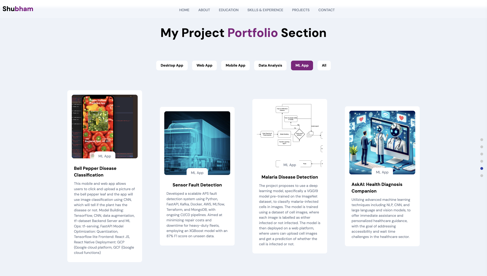

### Hi there 👋

<!--
**sverma1999/sverma1999** is a ✨ _special_ ✨ repository because its `README.md` (this file) appears on your GitHub profile.

Here are some ideas to get you started:

- 🔭 I’m currently working on ...
- 🌱 I’m currently learning ...
- 👯 I’m looking to collaborate on ...
- 🤔 I’m looking for help with ...
- 💬 Ask me about ...
- 📫 How to reach me: ...
- 😄 Pronouns: ...
- ⚡ Fun fact: ...
-->

<!-- GitHub Header and Visitor Badge -->

<!-- Animated Typing Effect -->
<h1 align="center">
  
</h1>

<!-- Introduction -->
<h3 align="center">Full-Stack Data Scientist with innovative and impact driven mindset</h3>

  

    Currently building a healthcare application using Large Language Models (LLMs), Deep Learning, Computer Vision, and AWS
  

  

    
    
    
    
  

  <a href="https://shubham05-portfolio.netlify.app/">
    
<b>Click here to explore some of my interesting work</b>

    
  </a>

<!-- Languages and Tools -->
<h2 align="center">Languages and Tools</h2>

                      <a href="https://hadoop.apache.org/" target="_blank" rel="noreferrer">  

<!-- GitHub Stats -->

  
  

